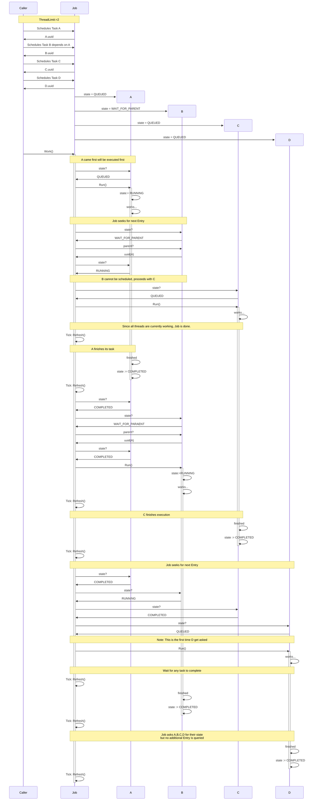
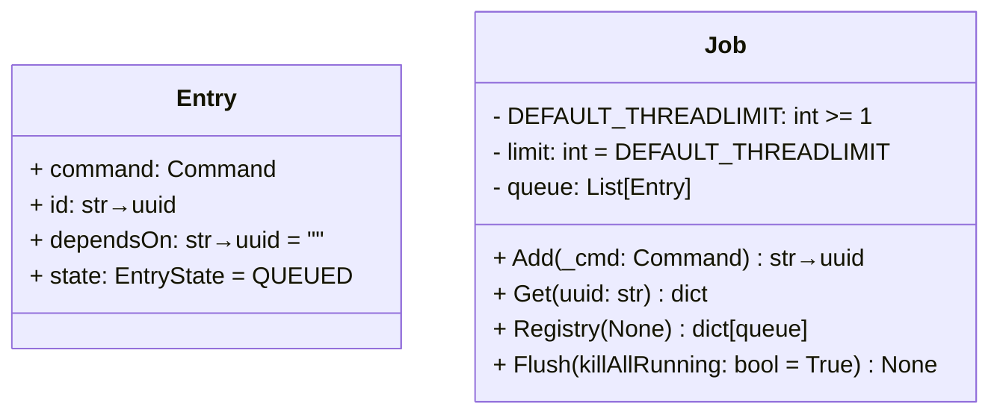

The Job Scheduling System should be a simple batch job system.
A Process can Schedule a Job just by providing the Command Object.
Each Job will get wrapped automagically.
When the first Job gets queried the Scheduler will start the worker thread.

## ThreadLimit := 1

Job works on "First Come, First Serve" unless a Childprocess can be started.

## Typical flow with 4 concurrent tasks and 2 threads

This shows how the Scheduler handles dependencies. As you can see only two tasks are running simultaneously.

1. A and C
2. B and C
3. B and D
4. only D

Note: The worker thread from Job will always run and does not count as running task.

Priorities:

The Scheduler is sensible to INTERNAL priorities.

OOOE (OutOfOrderExecution)
In order to prevent a critical Job from dangling "somewhere" in the Queue. All Jobs can promoted to an "URGENT" Job.
But the Command Timeout will be set to 100ms. After that the process will be terminated forcefully.

This project has implemented a flexible Framework to issue Commands (`class Command`) on the host system.
Command has no scheduling capabilities. 
When the System calls a Command to be executed this Scheduler (`Job`) wraps it around a `Entry`-Object.

A Job contains the following:

