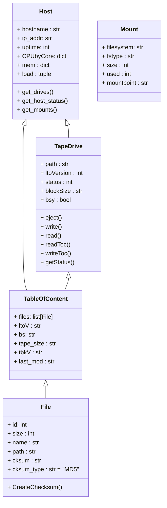

```mermaid
classDiagram


Host <|-- TapeDrive
Host <|-- TableOfContent
TapeDrive <|-- TableOfContent
TableOfContent <|-- File

class Host{
    + hostname : str
    + ip_addr: str
    + uptime: int
    + CPUbyCore: dict
    + mem : dict
    + load : tuple

    + get_drives()
    + get_host_status()
    + get_mounts()
}

class TapeDrive{
    + path : str
    + ltoVersion : int
    + status : int
    + blockSize : str
    + bsy : bool

    + eject()
    + write()
    + read()
    + readToc()
    + writeToc()
    + getStatus()
}

class Mount{
    + filesystem: str
    + fstype : str
    + size : int
    + used : int
    + mountpoint : str
}

class TableOfContent{
    + files: list[File]
    + ltoV : str
    + bs: str
    + tape_size : str
    + tbkV : str
    + last_mod : str
}

class File{
    + id: int
    + size : int
    + name : str
    + path : str
    + cksum : str
    + cksum_type : str = "MD5"

    + CreateChecksum()
}

```
