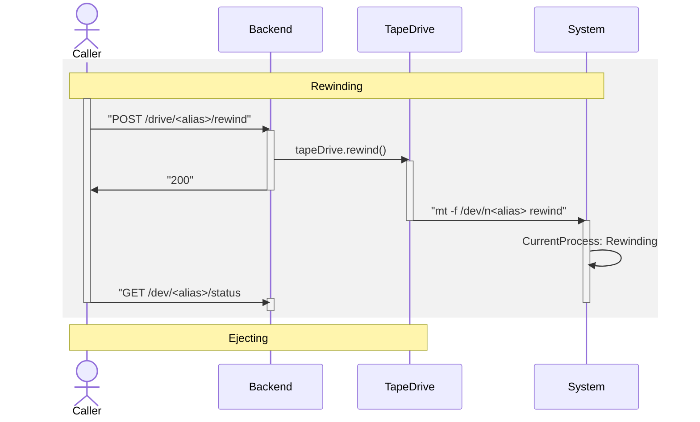

## Sequence Diagrams for specific Operations

## TapeDrive.<\<action>>

```mermaid
sequenceDiagram

actor Caller
participant Backend
participant TapeDrive
participant System


rect rgba(128,128,128,0.1)
note over Caller,System: Rewinding

activate Caller
Caller ->> Backend: "POST /drive/<alias>/rewind"
    activate Backend
        Backend ->> TapeDrive: tapeDrive.rewind()
        activate TapeDrive
            Backend ->> Caller: "200"
    deactivate Backend
            TapeDrive ->> System: "mt -f /dev/n<alias> rewind"
            activate System
        deactivate TapeDrive
                System ->> System: CurrentProcess: Rewinding
            

Caller ->> Backend: "GET /dev/<alias>/status
    activate Backend
    
    deactivate Backend
            deactivate System
deactivate Caller
end

note over Caller,TapeDrive: Ejecting


```

