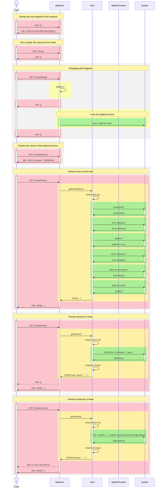
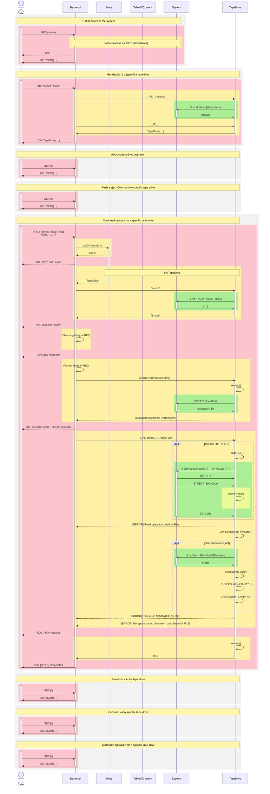

# REST-API Sequences

## Backend Startup

```mermaid
sequenceDiagram
```

## Host Functions

```mermaid
sequenceDiagram

actor Caller
participant Backend
participant Host
participant toc as TableOfContent
participant System


rect rgba(128,128,128,0.1)
note over Caller,Backend: Fetches the root endpoint of the backend

    rect rgba(255, 182, 193, 0.75)
    activate Caller
        Caller ->> Backend: GET: {/}
        activate Backend
            Backend ->> Caller: 200: {'THIS IS A RUTBS BACKEND'}
        deactivate Backend
    deactivate Caller
    end

end

rect rgba(128,128,128,0.1)
note over Caller,Backend: Get a simple 200 response from Node

    rect rgba(255, 182, 193, 0.75)
    activate Caller
        Caller ->> Backend: GET: {/host}
        activate Backend
            Backend ->> Caller: 200: {}
        deactivate Backend
    deactivate Caller
    end

end

rect rgba(128,128,128,0.1)
note over Caller,System: Debugging path triggered
    rect rgba(255, 182, 193, 0.75)
    activate Caller
        Caller ->> Backend: GET: {/host/debug}
        activate Backend
    end
        rect rgba(255, 255, 153, 0.75)
        Backend ->> Backend: DEBUG?
        end
    rect rgba(255, 182, 193, 0.75)
        Backend -->> Caller: 418: {}
    end
    rect rgba(255, 255, 153, 0.75)
        note over Backend, System: THIS IS A DEBUG-PATH!
        rect rgba(144, 238, 144, 0.75)
        Backend ->> System: print: "DEBUG done"
        end
    end
    rect rgba(255, 182, 193, 0.75)
        Backend ->> Caller: 418: {}
        deactivate Backend
        
    deactivate Caller
    end
end

rect rgba(128,128,128,0.1) 
note over Caller,Backend: Fetches the version of the backend service
    rect rgba(255, 182, 193, 0.75)
    activate Caller
        Caller ->> Backend: GET: {/host/version}
        activate Backend
            Backend ->> Caller: 200: JSON {"version": VERSION}
        deactivate Backend
    deactivate Caller
    end
end

rect rgba(128,128,128,0.1)
note over Caller,System: Fetches status of this node

rect rgba(255, 182, 193, 0.75)
activate Caller
    Caller ->> Backend: GET: {/host/status}
    activate Backend

    rect rgba(255, 255, 153, 0.75)
        Backend ->> Host: getHostStatus()
        activate Host
            Host ->> Host: refreshStatus()
    
    rect rgba(144, 238, 144, 0.75)
            Host ->> System: Hostname?
            activate System
                System ->> Host: {Hostname}
            deactivate System
    end
    rect rgba(144, 238, 144, 0.75)
                Host ->> System: IPv4-Address?
            activate System
                System ->> Host: {IPv4-Address}
            deactivate System
    end
    rect rgba(144, 238, 144, 0.75)
                Host ->> System: Uptime?
            activate System
                System ->> Host: {uptime in sec.}
            deactivate System
    end
    rect rgba(144, 238, 144, 0.75)
                Host ->> System: CPU-Utilization?
            activate System
                System ->> Host: {cpu-usage{,}}
            deactivate System
    end
    rect rgba(144, 238, 144, 0.75)
                Host ->> System: Memory-Allocation?
            activate System
                System ->> Host: {memory{,}}
            deactivate System
    end
    rect rgba(144, 238, 144, 0.75)
                Host ->> System: System-Load?
            activate System
                System ->> Host: {load{,}}                
            deactivate System
    end
            Host ->> Backend: JSON{…} 
        deactivate Host
    end
        Backend ->> Caller: 200: JSON{…}
    deactivate Backend
deactivate Caller
end
end


rect rgba(128,128,128,0.1)
note over Caller,System: Fetches all drives of Node

    rect rgba(255, 182, 193, 0.75)
    activate Caller
        Caller ->> Backend: GET: {/host/drives}
        
        activate Backend
        rect rgba(255, 255, 153, 0.75)
            Backend ->> Host: getDrives()
            activate Host
            Host ->> Host: subprocess.run()
                rect rgba(144, 238, 144, 0.75)
                Host ->> System: $ find /dev -maxdepth 1 -type c
                activate System
                    System ->> Host: {directory}
                deactivate System
                end
            Host ->> Host: Analyzes Output
            Host ->> Backend: JSON{"tape_drives": "…"}
            deactivate Host
        end
        Backend -->> Caller: 204: {}
        Backend ->> Caller: 200: JSON{…}
        deactivate Backend
        
    end
deactivate Caller
end

rect rgba(128,128,128,0.1)
Note over Caller,System: Fetches all Mounts of Node
    rect rgba(255, 182, 193, 0.75)
    activate Caller
    Caller ->> Backend: GET: {/host/mounts}
        activate Backend
        rect rgba(255, 255, 153, 0.75)
            Backend ->> Host: getMounts()
            activate Host
                Host ->> Host: subprocess.run()
                    rect rgba(144, 238, 144, 0.75)
                    Host ->> System: $ df -x tmpfs […] --output=source,size,used,target,fstype
                    activate System
                        System ->> Host: {filesystems}
                    deactivate System
                    end
                Host ->> Host: Analyzes Output
                Host ->> Backend: JSON{"mounts": "…"}
            deactivate Host
        end
        Backend -->> Caller: 200: {} | 500: ServerError
        Backend ->> Caller: 200: JSON{…}
        deactivate Backend
        
    end
    deactivate Caller
end

```

## Tape-Drive Functions

```mermaid
sequenceDiagram

actor Caller
participant Backend

participant Host
participant toc as TableOfContent
participant System
participant td as TapeDrive

rect rgba(128,128,128,0.1)
note over Caller,System: Get all drives of the system
rect rgba(255, 182, 193, 0.75)
activate Caller
    Caller ->> Backend: GET {/drive}
    activate Backend
    rect rgba(255, 255, 153, 0.75)
        Note over Backend,System: Same Process as: GET {/host/drives}
    end
        Backend -->> Caller: 204: {}
        Backend ->> Caller : 200: JSON{…}
     deactivate Backend
deactivate Caller
end
end

rect rgba(128,128,128,0.1)
note over Caller,td: Get details of a (specific) tape drive
rect rgba(255, 182, 193, 0.75)
activate Caller
     Caller ->> Backend: GET {/drive/{alias}}
     activate Backend
        rect rgba(255, 255, 153, 0.75)
        Backend ->> td: __init__({alias})
        activate td
            rect rgba(144, 238, 144, 0.75) 
            td ->> System: $ mt -f /dev/n{alias} status
            activate System
                System ->> td: {status}
            deactivate System
            end
            Backend ->> td: __str__()
            td ->> Backend: TapeDrive(…)
        deactivate td
        end
        Backend ->> Caller : 200: TapeDrive(…)
     deactivate Backend
deactivate Caller
end
end

rect rgba(128,128,128,0.1)
note over Caller,td: Abort current drive operation
rect rgba(255, 182, 193, 0.75)
activate Caller
     Caller ->> Backend: GET {/}
     activate Backend
        Backend ->> Caller : 200: JSON{…}
     deactivate Backend
deactivate Caller
end
end

rect rgba(128,128,128,0.1)
note over Caller,td: Push a eject Command to specific tape drive
rect rgba(255, 182, 193, 0.75)
activate Caller
     Caller ->> Backend: GET {/}
     activate Backend
        Backend ->> Caller : 200: JSON{…}
     deactivate Backend
deactivate Caller
end
end

rect rgba(128,128,128,0.1)
note over Caller,td: Start read process for a specific tape drive

    rect rgba(255, 182, 193, 0.75)
    activate Caller
        Caller ->> Backend: POST {/drive/<alias>/read<br>[body: <…>]}
        activate Backend
        rect rgba(255, 255, 153, 0.75)
            Backend ->> Host: getDrives(alias)
            activate Host
                Host -->> Backend: None
        end
                Backend -->> Caller: 404, Drive not Found
        rect rgba(255, 255, 153, 0.75)
                Note over Host,td: Init TapeDrive
                Host ->> Backend: {TapeDrive}
                
            deactivate Host
            Backend ->> td: Status?
            activate td
                rect rgba(144, 238, 144, 0.75)  
                td ->> System: $ mt -f /dev/n<alias> status
                activate System
                    System ->> td: {…}
                deactivate System
                end
                td ->> Backend: {Status}
            deactivate td
        end
            Backend -->> Caller: 409, Tape not Ready!
        rect rgba(255, 255, 153, 0.75)
        Backend ->> Backend: Checking Body of REQ
        end
        Backend -->> Caller: 400, Bad Request!
        rect rgba(255, 255, 153, 0.75)
        Backend ->> Backend: Parsing Body of REQ
        Backend ->> td: readTOC(destPath="/tmp")
        activate td
            td ->> td: rewind()
            rect rgba(144, 238, 144, 0.75)
                td ->> System: CREATE $destPath
                activate System
                    System -->> td: Exception: $e
                deactivate System
            end
            td -->> Backend: [ERROR] Insufficient Permissions
        deactivate td 
        end
            Backend -->> Caller: 500, [READ] Failed, TOC not readable
        rect rgba(255, 255, 153, 0.75)
            Backend ->> td: READ toc.file[] TO destPath
            activate td
            loop foreach FILE in TOC
                td ->> td: read(FILE)
                rect rgba(144, 238, 144, 0.75)
                    td ->> System: $ dd if=/dev/n<alias> […] of=file.path […]
                    activate System
                    System ->> td: STDOUT
                    System -->> td: STDERR, Exit Code
                    rect rgba(255, 255, 153, 0.75)
                        td -->> td: EXCEPTION
                    end
                    System ->> td: Exit Code
                    deactivate System
                end
            end
            td -->> Backend: [ERROR] Read operation failed at $file
            td ->> td: Are Checksums available?
            loop calcChecksums(toc)
                rect rgba(144, 238, 144, 0.75)
                    td ->> System: $ md5sum $destPath/$file.name
                    activate System
                        System ->> td: {md5}
                    deactivate System
                end
                td ->> td: Checksums valid?
                td -->> td: CHECKSUM_MISMATCH
                td -->> td: CHECKSUM_EXCPTION
            end
            td -->> Backend: [ERROR] Checksum MISMATCH for FILE
            td -->> Backend: [ERROR] Exception during checksum calculation for FILE
        end
        Backend -->> Caller: 500, JSON{Status}
        rect rgba(255, 255, 153, 0.75)
            td ->> td: rewind()
            td ->> Backend: TOC
            deactivate td
        end
        Backend ->> Caller: 200: [READ] Completed

        deactivate Backend
    deactivate Caller
end
end

rect rgba(128,128,128,0.1)
note over Caller,td: Rewind a specific tape drive
rect rgba(255, 182, 193, 0.75)
activate Caller
     Caller ->> Backend: GET {/}
     activate Backend
        Backend ->> Caller : 200: JSON{…}
     deactivate Backend
deactivate Caller
end
end

rect rgba(128,128,128,0.1)
note over Caller,td: Get status of a specific tape drive
rect rgba(255, 182, 193, 0.75)
activate Caller
     Caller ->> Backend: GET {/}
     activate Backend
        Backend ->> Caller : 200: JSON{…}
     deactivate Backend
deactivate Caller
end
end

rect rgba(128,128,128,0.1)
note over Caller,td: Start write operation for a specific tape drive
rect rgba(255, 182, 193, 0.75)
activate Caller
     Caller ->> Backend: GET {/}
     activate Backend
        Backend ->> Caller : 200: JSON{…}
     deactivate Backend
deactivate Caller
end
end


```
